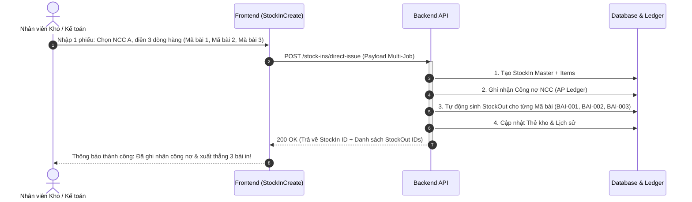

# ĐỀ XUẤT NÂNG CẤP API CHO BACKEND (BE RFC)
## TÍNH NĂNG: NHẬP VẬT TƯ GIAO THẲNG CHO NHIỀU BÀI IN (DIRECT ISSUE MULTI-JOB) & ĐỒNG BỘ CÔNG NỢ NCC

- **Tác giả:** Đội ngũ Frontend / Phân tích Nghiệp vụ
- **Mục tiêu:** Gửi đội ngũ Backend đánh giá giải pháp mở rộng/nâng cấp API quản lý Kho & Công nợ, tối ưu thời gian thao tác và đảm bảo tính toàn vẹn dữ liệu không gây breaking changes.
- **Trạng thái:** Chờ Backend Review & Thống nhất API Contract

---

## 1. BỐI CẢNH & BÀI TOÁN NGHIỆP VỤ (BUSINESS CONTEXT)

### 1.1. Hiện trạng vận hành thực tế
Trong ngành in bao bì, không phải vật tư nào mua về cũng được lưu kho dài hạn:
1. **Hàng lưu kho (Stock-to-Inventory):** Mua số lượng lớn tích trữ (giấy cuộn, giấy ram phổ thông, phụ liệu dùng chung) $\rightarrow$ Cần lưu kho, theo dõi tồn kho, khi nào in mới xuất.
2. **Hàng mua theo bài (Direct-to-Job / Just-In-Time Procurement):** 
   - Đặt nhà cung cấp (NCC) giao giấy/vật tư đặc thù riêng cho từng đơn hàng / bài in.
   - **Tình huống phổ biến:** NCC A giao **1 phiếu giao hàng** gồm 3 loại hàng/vật tư khác nhau, mỗi dòng tương ứng với một **Mã bài (Bài in / Lệnh sản xuất)** riêng biệt:
     - Dòng 1: Giấy Couche 300 (1.000 tờ) $\rightarrow$ Dùng cho **Mã bài: BAI-001**
     - Dòng 2: Giấy Duplex 350 (2.500 tờ) $\rightarrow$ Dùng cho **Mã bài: BAI-002**
     - Dòng 3: Decal vỡ (500 tờ) $\rightarrow$ Dùng cho **Mã bài: BAI-003**

### 1.2. Yêu cầu mong muốn của người dùng
Người dùng chỉ cần vào hệ thống tạo **1 phiếu nhập duy nhất**:
1. Chọn Nhà cung cấp A.
2. Nhập các dòng hàng (Tên hàng/Vật tư, Số lượng, Đơn vị, Đơn giá, **Mã bài in tương ứng**).
3. Ấn **Lưu** $\rightarrow$ Hệ thống tự động xử lý ngầm (All-in-One):
   - **Ghi nhận 1 khoản Công nợ tổng (AP)** cho NCC A.
   - **Tự động sinh phiếu Xuất kho thẳng vào từng bài in** (`BAI-001`, `BAI-002`, `BAI-003`).
   - **Tồn kho thực tế không bị giữ ảo**, loại bỏ hoàn toàn bước trung gian người dùng phải sang trang Xuất kho tìm từng bài để xuất thủ công.

---

## 2. ĐÁNH GIÁ CÁC API HIỆN TẠI & ĐIỂM NGHẼN (CURRENT API BOTTLENECKS)

### 2.1. API `POST /stock-ins/from-vendor`
* **Schema hiện tại:** `CreateStockInFromVendorRequest` nhận danh sách `items: StockInItemRequest[]`.
* **Điểm nghẽn:** 
  - API này chỉ ghi nhận Nhập kho (`StockIn`) và Công nợ NCC (`vendorId`).
  - Mặc dù mỗi `item` có nhận trường `jobCode`, nhưng backend **chỉ lưu `jobCode` dưới dạng ghi chú/metadata**, toàn bộ số lượng vẫn được cộng vào tồn kho (`CurrentStock`) và **không tự động sinh phiếu Xuất kho (`StockOut`)**.
  - Người dùng buộc phải sang màn hình Quản lý kho / Xuất kho để làm thêm thao tác xuất từng bài.

### 2.2. API `POST /stock-ins/direct-issue`
* **Schema hiện tại (`DirectMaterialIssueRequest`):**
  ```json
  {
    "vendorId": 12,
    "productionOrderCode": "BAI-001",
    "items": [
      {
        "materialId": 105,
        "quantity": 1000,
        "unitPrice": 15000
      }
    ],
    "notes": "Nhập xuất trực tiếp"
  }
  ```
* **Điểm nghẽn nghiêm trọng:**
  1. `productionOrderCode` đang nằm ở **cấp Root của Request** $\rightarrow$ Chỉ hỗ trợ 1 mã bài duy nhất cho toàn bộ phiếu. Nếu 1 phiếu giao hàng có 3 bài khác nhau thì không thể gửi trong 1 request.
  2. Bắt buộc phải truyền `materialId: number` (vật tư đã có sẵn trong danh mục). Đối với các vật tư quy cách cắt xén đặc thù theo đơn, việc bắt buộc tạo danh mục trước gây nghẽn thao tác.

---

## 3. ĐỀ XUẤT GIẢI PHÁP CHO BACKEND (TECHNICAL PROPOSAL)

Để đảm bảo **không phá vỡ (Breaking Change)** các luồng hiện tại mà vẫn giải quyết triệt để bài toán, đề xuất BE triển khai theo 1 trong 2 phương án sau (Khuyên dùng **Phương án 1**):

---

### PHƯƠNG ÁN 1 (KHUYÊN DÙNG): Bổ sung API chuyên dụng `POST /stock-ins/direct-issue-batch` (hoặc mở rộng `POST /stock-ins/direct-issue`)

Tạo mới (hoặc mở rộng) endpoint xử lý trọn gói 1 phiếu nhập từ NCC cho nhiều bài in khác nhau.

#### Endpoint:
`POST /stock-ins/direct-issue` (hoặc `POST /stock-ins/direct-issue-batch`)

#### Request Payload:
```json
{
  "vendorId": 12,
  "stockInDate": "2026-08-11T12:00:00.000Z",
  "notes": "Phiếu giao hàng số HD-8899 từ NCC Giấy Mai Linh",
  "laborCost": 50000,
  "items": [
    {
      "materialId": 101,
      "itemName": "Giấy Couche 300 65x86",
      "itemCode": "C300-65x86",
      "unit": "tờ",
      "quantity": 1000,
      "unitPrice": 4500,
      "lineAmount": 4500000,
      "jobCode": "BAI-001",
      "productionOrderId": 201,
      "notes": "In bìa catalogue"
    },
    {
      "materialId": 102,
      "itemName": "Giấy Duplex 350 79x109",
      "itemCode": "DUPLEX-350-79x109",
      "unit": "tờ",
      "quantity": 2500,
      "unitPrice": 6200,
      "lineAmount": 15500000,
      "jobCode": "BAI-002",
      "productionOrderId": 202,
      "notes": "Hộp bánh trung thu"
    },
    {
      "materialId": null,
      "materialTypeId": 5,
      "itemName": "Decal vỡ bế sẵn 10x15cm",
      "unit": "cuộn",
      "quantity": 20,
      "unitPrice": 120000,
      "lineAmount": 2400000,
      "jobCode": "BAI-003",
      "productionOrderId": null,
      "notes": "Tem niêm phong"
    },
    {
      "materialId": 108,
      "itemName": "Giấy Kraft 120 (Mua lưu kho thêm)",
      "unit": "ram",
      "quantity": 5,
      "unitPrice": 350000,
      "lineAmount": 1750000,
      "jobCode": null,
      "productionOrderId": null,
      "notes": "Dòng này không có mã bài -> Lưu kho bình thường"
    }
  ]
}
```

#### Xử lý Nghiệp vụ & DB Transaction tại Backend:
Backend thực thi trong **1 Database Transaction duy nhất**:
1. **Tạo Phiếu Nhập Kho (`StockIn`):**
   - Tạo 1 bản ghi `StockIn` master với `vendorId`, `stockInDate`, `laborCost`, `totalAmount` = $\sum \text{lineAmount} + \text{laborCost}$.
   - Tạo toàn bộ $N$ bản ghi `StockInItem`.
   - **Ghi nhận Công nợ (AP):** Hệ thống AP tự động ghi nhận khoản phải trả tổng cho NCC này tương tự như luồng `StockIn` chuẩn.
2. **Xử lý Tự động Xuất Kho theo từng Bài In (`StockOut`):**
   - Lọc các items có `jobCode` hoặc `productionOrderId`.
   - **Gom nhóm (Group By) theo từng Mã bài in (`jobCode` / `productionOrderId`):**
     - Với mỗi bài in $K$: Tự động tạo 1 bản ghi `StockOut` (Loại xuất: `production` / `direct_issue`, liên kết với `productionOrderId` hoặc ghi chú `jobCode`).
     - Thêm các dòng `StockOutItem` tương ứng của bài in $K$.
     - Đánh dấu trạng thái phiếu xuất là `COMPLETED` (Đã xuất thẳng vào sản xuất).
   - Với các dòng không có `jobCode`: Số lượng được giữ nguyên trong tồn kho (`CurrentStock`) để phục vụ lưu kho thông thường.
3. **Cập nhật Thẻ kho (`StockCard`) & Sổ theo dõi:**
   - Dòng nhập xuất trực tiếp: Ghi nhận 1 giao dịch Nhập (+) và ngay lập tức 1 giao dịch Xuất (-) tương ứng, đảm bảo kiểm toán lịch sử kho hoàn chỉnh.
4. **Commit Transaction.**

#### Response Payload mong đợi:
```json
{
  "success": true,
  "stockIn": {
    "id": 501,
    "code": "NK-20260811-001",
    "totalAmount": 24200000,
    "vendorId": 12,
    "vendorName": "NCC Giấy Mai Linh"
  },
  "generatedStockOuts": [
    {
      "id": 601,
      "code": "XK-20260811-001",
      "jobCode": "BAI-001",
      "productionOrderId": 201,
      "itemCount": 1
    },
    {
      "id": 602,
      "code": "XK-20260811-002",
      "jobCode": "BAI-002",
      "productionOrderId": 202,
      "itemCount": 1
    },
    {
      "id": 603,
      "code": "XK-20260811-003",
      "jobCode": "BAI-003",
      "productionOrderId": null,
      "itemCount": 1
    }
  ],
  "retainedInStockCount": 1,
  "message": "Đã tạo phiếu nhập kho, ghi nhận công nợ và tự động xuất kho cho 3 bài in thành công"
}
```

---

### PHƯƠNG ÁN 2: Tích hợp cờ `autoIssueForJobs: boolean` vào ngay API `POST /stock-ins/from-vendor`

Nếu BE muốn tái sử dụng tối đa endpoint hiện có mà không tạo route mới:
* Thêm tham số tùy chọn: `"autoIssueForJobs": true` trong `CreateStockInFromVendorRequest`.
* Khi `autoIssueForJobs = true`: Backend kích hoạt logic tách và tự sinh phiếu `StockOut` cho những dòng có `jobCode` như mô tả ở Bước 2 Phương án 1.
* Khi `autoIssueForJobs = false` (hoặc không truyền): Backend giữ nguyên hành vi cũ (chỉ nhập kho lưu trữ).

---

## 4. CÁC QUY TẮC NGHIỆP VỤ & TOÀN VẸN DỮ LIỆU CẦN LƯU Ý (EDGE CASES)

| Tình huống | Hành vi mong muốn |
| :--- | :--- |
| **1. Mã bài in (`jobCode`) không tồn tại trong hệ thống Lệnh SX** | Cho phép nhập dạng chuỗi tự do (chưa tạo lệnh sản xuất chính thức trên phần mềm nhưng xưởng in đã chạy thực tế). Lúc này tạo `StockOut` với trường ghi chú `jobCode: "BAI-001"`, `productionOrderId = null`. |
| **2. Cập nhật đơn giá sau khi nhập (`UpdateStockInPrices`)** | Khi kế toán cập nhật giá cho phiếu Nhập kho (`StockInItem`), Backend cần cập nhật đồng thời:<br>1. Công nợ NCC (AP).<br>2. Giá vốn của dòng phiếu xuất kho (`StockOutItem`) tương ứng để chi phí bài in không bị lệch. |
| **3. Hủy phiếu nhập kho (`Cancel StockIn`)** | Nếu phiếu Nhập kho bị hủy, hệ thống cần kiểm tra và tự động hủy luôn các phiếu Xuất kho liên kết (`generatedStockOuts`) được sinh tự động từ phiếu này. |
| **4. Vật tư chưa có trong danh mục (`materialId = null`)** | Cho phép tạo trực tiếp với `itemName`, `unit`, `materialTypeId` (hoặc tự động tạo nhanh vào bảng `Material` nếu cần thiết) mà không bắt lỗi 400. |

---

## 5. KẾ HOẠCH PHỐI HỢP TRIỂN KHAI GIỮA FE & BE



1. **Phía Backend:** 
   - Đánh giá và chọn Phương án 1 hoặc Phương án 2.
   - Triển khai Transaction DB xử lý Nhập kho + Tự động xuất kho theo nhóm bài in.
   - Cập nhật Swagger / OpenAPI doc.
2. **Phía Frontend:**
   - Nâng cấp màn hình `StockInCreate.tsx`: Thêm gợi ý Mã bài in (`JobCodeSelector`), hỗ trợ nhập nhanh đơn giá và xuất thẳng.
   - Tinh gọn bỏ các bước trung gian thủ công ở `StockSummary.tsx`.
   - Kết nối mutation mới và kiểm thử toàn diện luồng Kho & Sổ cái Công nợ AP.

---
*Kính mong đội ngũ Backend xem xét và cho ý kiến phản hồi để hai bên tiến hành tích hợp!*
